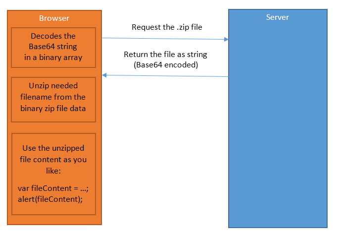

# Unzip-file-in-browser
Javascript, Ajax

## What is Unzip-file-in-browser ?
This is a small Javascript which gets ZIP file from server into browser and unpack needed file from ZIP.

## Why don't you use some ready solutions like JSZip/ZipJS/etc ?
They are all written for NodeJS and are not anymore compatible for direct use in browsers. 
Also I think the spaghetti model of NodeJS dependencies (and Maven) are in some situation not very practical/effective.
So what I needed was a straight-forward slim solution for Unzipping and I just made it, which fits my needs best.

## Documentation / How to use



The main flow between browser and server is trough Ajax call which transfers the zip file. 
The zip file is transferred as Base64 encoded since Ajax call works natively with TEXT.
When the file is received in browser first it is decoded from Base64 to BINARY and then unzipped.

```Javascript
	try {
		//  Provide the file as binaryStream and needed file to unzip:
		unzippedFileData = VZip.unzip(zipAsBinary, filenameToUnzip);
		
		//  Do what you want with unzipped data:
		alert(unzippedFileData);
	}
	catch (e) {
		//  Exception: Invaild zip file; Unsupported encoding algorithm; File for unzipping not found:
		alert(e);
	}
```

Find Unzip demo and full Documentation [here](http://www.viki3d.com/demos/Unzip-file-in-browser/)